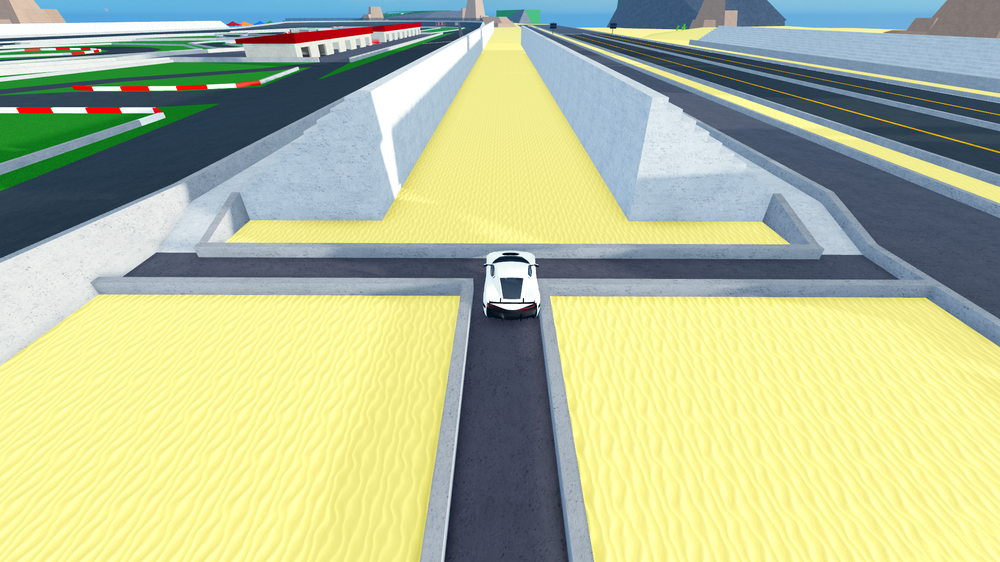
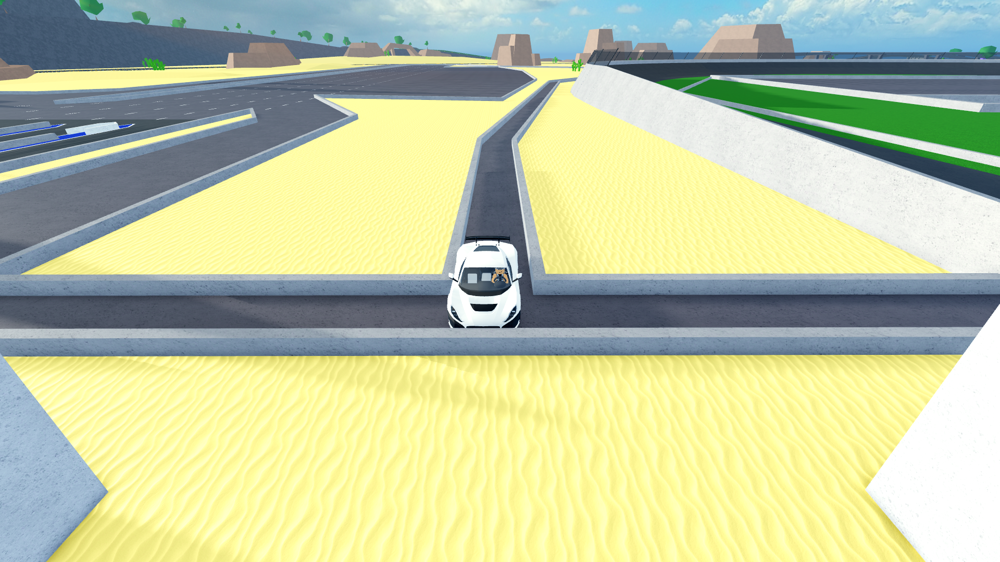

# Car Dealership Tycoon Autofarm
## Setup
1. Download and open [Tinytask](https://tinytask.net/).
2. Open Roblox and join a server in Car Dealership Tycoon (it's better to join a private server).
3. Pick your fastest vehicle, and according to it's engine type do the following:
    - Petrol engine: download the file `CDT autofarm - electric.rec`.
    - Electric engine: download the file `CDT autofarm - gasoline.rec`.
    - If you can't recognize if the engine is electric or petrol-fueled, listen to the sound and check the gears: if the sound is like a whistle and the vehicle car has only one gear, it has an electric engine.
4. Import in Tinytask the file downloaded in the previous step (`Open` -> choose the file you downloaded)
5. Set Tinytask's playback shortcut to one you can easily access (I have it set to `F8`) (`Prefs` -> `Playback Hotkey` -> choose one of the shortcuts)
6. Enable Tinytask's `Continuous Playback` option (`Prefs` -> click on `Continuous Playback`)

## How to use in-game
1. Teleport to **Circuit Race** with the vehicle you chose.
2. Go with your vehicle in this exact spot:

3. Press the key you set as Tinytask's playback shortcut.\
The autofarm will now work until you stop it, pressing the playback shortcut once again.

## FAQs
**Q: Will I be kicked out of the game after 20 minutes of inactivity?**\
A: No, thanks to Tinytask pressing the buttons for you, Roblox will think it's you pressing the keyboard's buttons, and not Tinytask.

**Q: Why does it matter if my car is electric or petrol-fueled?**\
A: In Car Dealership Tycoon, electric cars have a reverse top speed higher than that of petrol-fueled ones.\
Using the recording for electric cars on petrol-fueled cars will result in a lower money profit, and using the recording for petrol-fueled cars on electric cars will produce unexpected results (the car may go out of the circuit bounds and end up in the sea).

**Q: Will the farm stop working after a while?**\
A: Even though the car may do strange things after a while, and it may look like the car "bugged out" (especially for the electric cars recording), the issue will resolve on itself after a little while, making the farm able to work theoretically forever.\
Both farms have been tested for many consecutive hours, and not a single unexpected interruption was recorded.
